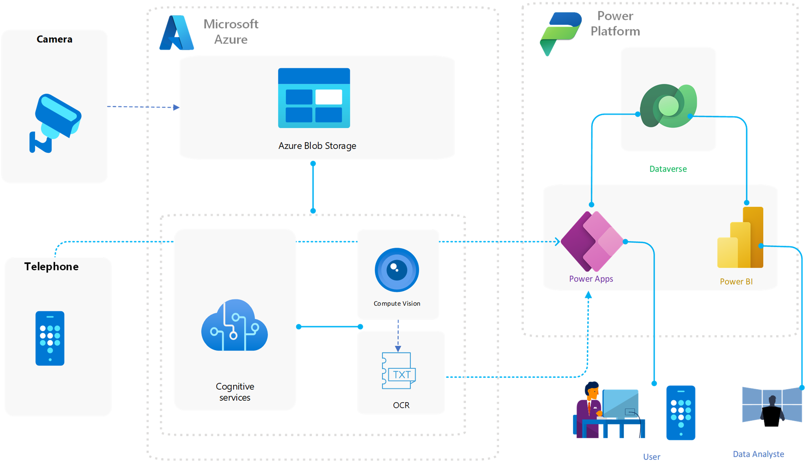
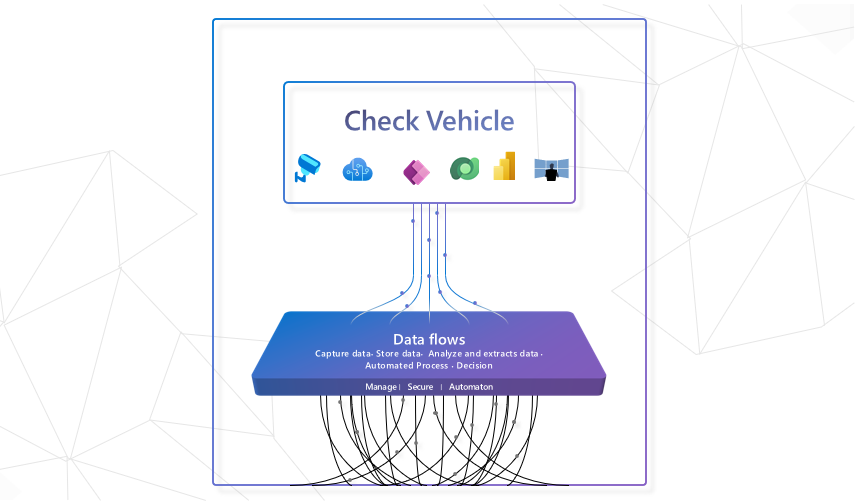

Let's automate the vehicle identification with the Check Vehicle solution which is for us a better solution to remedy the problem of taxes for the movers.

## About

This system utilizes cutting-edge image recognition technology to extract text from a vehicle's license plate, and then searches a database to determine if the vehicle is registered. If the vehicle is not found in the database, it is deemed unregistered. This system is designed to be fast, efficient, and easy to use, making it the perfect solution for any organization that needs to quickly and accurately check the registration status of vehicles. With its powerful capabilities, this system is sure to revolutionize the way we manage and track vehicle registration.

## Architecture

## Details

The check vehicle system is a powerful tool that utilizes the latest in image recognition technology to extract text from a vehicle's license plate. The extracted text is then used to search a database to determine if the vehicle is registered or not. The system is built using Power Apps, AI Builder and SharePoint List for database, which provides a user-friendly interface and robust capabilities for image recognition. Additionally, the project utilizes Azure File to store the data, allowing for increased scalability, availability, and security.

This system is designed to be highly efficient and able to process multiple vehicles in a short period of time. It can easily be integrated with existing databases and systems, making it a versatile solution for any organization that needs to check the registration status of vehicles.

The system's powerful image recognition capabilities allow it to accurately extract text from license plates even in challenging conditions such as low lighting or glare. This makes it ideal for use in various environments such as parking lots or traffic control. Additionally, the system's use of Azure File ensures that the data is stored and accessed securely in the cloud.

Overall, the prototype check vehicle system is a powerful and innovative solution that can revolutionize the way we manage and track vehicle registration. It is fast, efficient, accurate and secure, making it the perfect choice for any organization looking to streamline their vehicle registration process.

